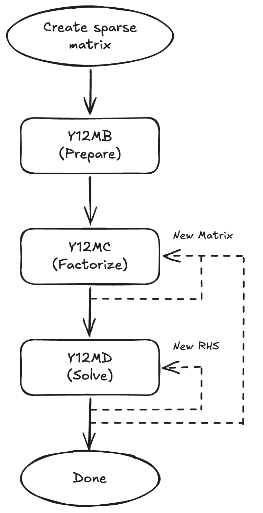

# y12m

Solution of Large and Sparse Systems of Linear Algebraic Equations

**Original version at Netlib:** http://www.netlib.org/y12m/

**Book:**

> Zlatev, Z., Wasniewski, J., & Schaumburg, K. (1981). Y12M: solution of large and sparse systems of linear algebraic equations (Vol. 121). Berlin, Heidelberg, New York: Springer. https://doi.org/10.1007/3-540-10874-2

**Home page of author Zahari Zlatev:** https://www.dmu.dk/atmosphericenvironment/staff/zlatev.htm

## Calling Sequence

The Y12M package provides subroutines at two levels. The `y12m` Fortran module provides **generic interfaces** (e.g., `y12ma`, `y12mb`) that automatically dispatch to the single-precision (`E`) or double-precision (`F`) variant depending on the type of the actual arguments. The individual precision-specific external procedures (e.g., `y12mbe` / `y12mbf`) can also be called directly by linking the library, without using the module.

### High-level drivers

| Subroutine | Purpose |
|------------|---------|
| `Y12MA` | Black-box driver for a single system with a single right-hand side. Calls `Y12MB`, `Y12MC`, and `Y12MD` internally. |
| `Y12MF` | Factorizes and solves a system in one call with iterative refinement to improve accuracy. |

### Lower-level subroutines

For finer control—solving the same system for multiple right-hand sides, reusing an existing LU factorization, or processing a sequence of matrices that share the same sparsity structure—the lower-level subroutines should be called directly (see also [docs/multiple_rhs.md](docs/multiple_rhs.md)):

| Subroutine | Purpose |
|------------|---------|
| `Y12MB` | Prepares and reorders the matrix for factorization. |
| `Y12MC` | Computes the LU factorization of the matrix. |
| `Y12MD` | Solves the system using the LU factorization. |
| `Y12MG` | Computes the reciprocal of the condition number. *(optional)* |
| `Y12MH` | Computes the one-norm of matrix A. *(optional)* |

### Calling order

	

The two optional subroutines have positional constraints:

- **`Y12MH`** must be called **before `Y12MC`**, because the LU factorization overwrites the matrix values stored in array `A`.
- **`Y12MG`** must be called **after `Y12MC`**, while the LU factorization is still intact. It takes the one-norm computed by `Y12MH` as an input argument.

