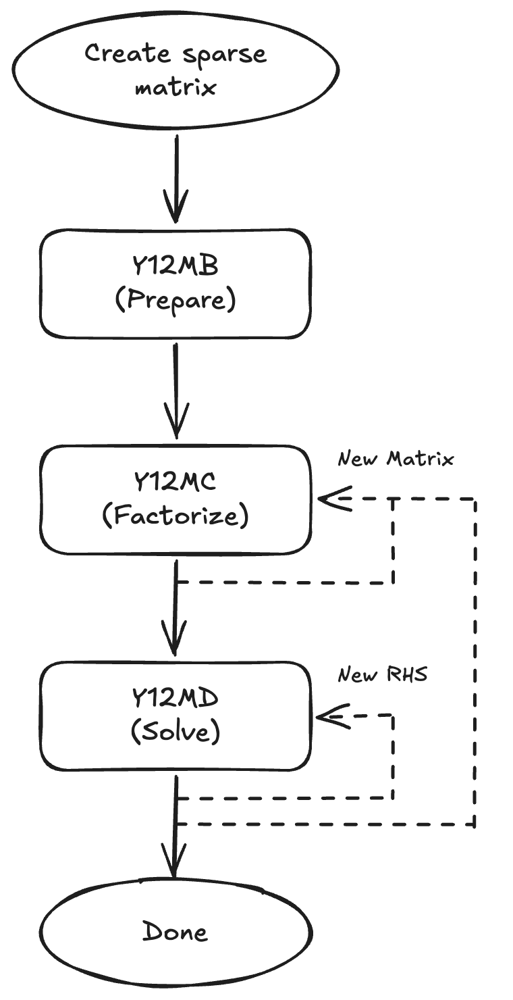

# y12m

Sparse direct solver for systems of linear equations **Ax = b**.  
Sequential, in-core LU factorization with partial pivoting and Markowitz
reordering.

> **Disclaimer:** This is a modified version of the Y12M library originally
> distributed through Netlib. The original source and documentation are
> available at <http://www.netlib.org/y12m/>.  All algorithmic credit belongs
> to the original authors.

**Book:**

> Zlatev, Z., Wasniewski, J., & Schaumburg, K. (1981). *Y12M: Solution of
> Large and Sparse Systems of Linear Algebraic Equations*, Lecture Notes in
> Computer Science, Vol. 121. Springer, Berlin.
> <https://doi.org/10.1007/3-540-10874-2>

**Home page of original author Zahari Zlatev:** <https://www.dmu.dk/atmosphericenvironment/staff/zlatev.htm>

---

## Contents

- [When to use Y12M](#when-to-use-y12m)
  - [Advantages](#advantages)
  - [Limitations](#limitations)
  - [Alternatives worth considering](#alternatives-worth-considering)
- [Building with CMake](#building-with-cmake)
- [API overview](#api-overview)
- [Citation](#citation)

---

## When to use Y12M

### Advantages

- **Simple and self-contained.** Pure Fortran, no external dependencies, easy
  to embed in existing projects.
- **Robust pivoting.** Combines Markowitz minimum-degree reordering with
  threshold pivoting; reliable on the difficult matrices that arise in stiff
  ODE integration and atmospheric chemistry.
- **Developed for production use.** Designed in the early 1980s by the
  original authors specifically for large-scale stiff ODE integrators and
  atmospheric chemistry models.
- **Multiple-RHS and structural reuse.** The lower-level API (`Y12MB` /
  `Y12MC` / `Y12MD`) lets you reuse an LU factorization or a sparsity
  ordering across multiple solves (see [docs/multiple_rhs.md](docs/multiple_rhs.md)).
- **Iterative refinement.** `Y12MF` provides built-in iterative refinement for
  extra accuracy.  Residuals are accumulated in extended precision: double
  precision in `Y12MFE`, and quad precision (or a double-double software
  emulation when the compiler lacks quad support) in `Y12MFF`.

### Limitations

- **32-bit integer indexing.** Internal integer arrays use default `INTEGER`
  (32-bit), so the practical limit is matrices of a few tens of thousands of
  rows/columns.  Very large problems (n ≳ 46 000) may trigger integer overflow
  in some internal Markowitz counters.
- **Sequential only.** There is no shared-memory or distributed-memory
  parallelism; a single thread is used throughout.
- **Fortran 77–style API.** The calling convention requires pre-allocated
  workspace arrays and integer flag vectors; it is more verbose than modern
  solver interfaces.
- **No fill-in reduction ordering.** There is no global, pre-factorization
  fill-in reducing ordering (AMD, COLAMD, RCM, …).  `Y12MC` applies only a
  greedy local Markowitz strategy during elimination.  Users can apply an
  external permutation themselves before calling `Y12MB`; see
  [docs/fill_in_ordering.md](docs/fill_in_ordering.md).
- **Static workspace allocation.** The work arrays (`A`/`SNR`/`RNR` sized
  by `NN` and `NN1`) must be pre-allocated by the caller before the solve.
  Because the amount of fill-in is not known in advance, these arrays must be
  over-provisioned, and the solver will fail with an error if they are too
  small.  Newer direct solvers address this by managing memory dynamically,
  sometimes under explicit user control.

### Alternatives worth considering

For a broader survey see:
[*Direct Solvers for Sparse Matrices*](https://portal.nersc.gov/project/sparse/superlu/SparseDirectSurvey.pdf),
X. Li, April 2022.

| Library | Notes |
|---------|-------|
| [UMFPACK](https://people.engr.tamu.edu/davis/suitesparse.html) | Multifrontal LU; part of SuiteSparse. Widely used general-purpose choice. |
| [SuperLU](https://portal.nersc.gov/project/sparse/superlu/) | Supernodal LU; sequential and distributed (SuperLU_DIST) variants available. |
| [Eigen `SparseLU`](https://eigen.tuxfamily.org) | Header-only C++ with a modern API; good for moderate-size problems. |
| [MUMPS](https://mumps-solver.org) | Multifrontal, supports MPI; excellent for very large distributed problems. |
| [MKL PARDISO / DSS](https://www.intel.com/content/www/us/en/docs/onemkl/developer-reference-fortran/current/pardiso.html) | High-performance threaded solver bundled with Intel oneAPI MKL. |
| [Panua PARDISO](https://panua.ch/pardiso/) | Commercial successor to the original Basel PARDISO; supports shared-memory parallelism. |
| [Apple Accelerate Sparse](https://developer.apple.com/documentation/accelerate/sparse_solvers) | Native sparse direct solvers on macOS/iOS via the Accelerate framework. |

---

## Building with CMake

```sh
git clone https://github.com/ivan-pi/y12m.git && cd y12m
cmake -B build -DCMAKE_Fortran_COMPILER=gfortran
cmake --build build
ctest --test-dir build          # run the test suite
```

The build produces a static library `liby12m_legacy` and, optionally, the
example programs.  The `y12m` Fortran module (`.mod` file) is placed in
`build/include/`.

The library (without tests and examples) can also be built with
[fpm](https://fpm.fortran-lang.org): `fpm build`.

At configure time CMake detects whether the Fortran compiler supports quad
precision (`selected_real_kind(33)`) and reports which residual accumulator
the double-precision iterative-refinement routine `Y12MFF` will use: native
quad precision, or a double-double emulation (Dekker's product splitting by
default; pass `-DY12M_USE_IEEE_FMA=ON` to use the Fortran 2018 `IEEE_FMA`
intrinsic instead, worthwhile only when the compiler inlines it to a
hardware instruction).  Pass `-DY12M_FORCE_DOUBLE_DOUBLE=ON` to force the
double-double path even when quad precision is available — useful for
bit-reproducible results across compilers and for testing the fallback.
The module constants `y12mff_uses_quad` and `y12mff_accumulator_kind`
expose the compiled-in choice to user code.  Note that the double-double
arithmetic requires IEEE-compliant evaluation; the CMake build compiles
`src/y12mff.F90` with the appropriate flags (for gfortran:
`-fno-unsafe-math-optimizations -ffp-contract=off`) so that a global
`-ffast-math`/`-Ofast` — or FMA contraction on fma-capable hardware —
cannot silently break it (see `cmake/Y12mffAccumulator.cmake`).

> **Note for contributors:** most fixed-form sources in `src/legacy/` are
> generated from the [Fypp](https://github.com/aradi/fypp) templates in
> `templates/`; each template expands to both the single- (`E`) and
> double-precision (`F`) variant of a routine.  The generated files are
> committed, so building the package does **not** require Fypp.  After
> editing a template, regenerate with `make -C templates` and commit the
> result; CI verifies that templates and generated sources stay in sync.

---

## API overview

The `y12m` Fortran module exposes **generic interfaces** (`y12ma`, `y12mb`, …)
that dispatch automatically to the single-precision (`E`) or double-precision
(`F`) variant based on the type of the actual arguments.  The
precision-specific external procedures (`y12mbe` / `y12mbf`, etc.) can also be
called directly without the module.

A C interface is provided in [`include/y12m.h`](include/y12m.h) as static
inline wrappers over the Fortran entry points.

### High-level drivers

| Subroutine | Purpose |
|------------|---------|
| `Y12MA` | Black-box driver: single matrix, single RHS. Calls `Y12MB` + `Y12MC` + `Y12MD` internally. |
| `Y12MF` | Factorize and solve with iterative refinement in one call. |

### Lower-level subroutines

| Subroutine | Purpose |
|------------|---------|
| `Y12MB` | Reorder and prepare the matrix for factorization. |
| `Y12MC` | Compute the LU factorization. |
| `Y12MD` | Solve using an existing LU factorization. |
| `Y12MG` | Estimate the reciprocal condition number. *(optional)* |
| `Y12MH` | Compute the one-norm of **A**. *(optional, must precede `Y12MC`)* |

### Calling order

<p align="center">
   
</p>

For detailed usage scenarios (multiple RHS, structure reuse, condition
estimation) see [docs/multiple_rhs.md](docs/multiple_rhs.md) and the full
[API reference](docs/API.md).

---

## Citation

If you use Y12M in published work, please cite the accompanying book:

```bibtex
@book{zlatev1981y12m,
  author    = {Zlatev, Zahari and Wasniewski, Jerzy and Schaumburg, Kjeld},
  title     = {{Y12M}: Solution of Large and Sparse Systems of Linear
               Algebraic Equations},
  series    = {Lecture Notes in Computer Science},
  volume    = {121},
  publisher = {Springer},
  address   = {Berlin, Heidelberg, New York},
  year      = {1981},
  doi       = {10.1007/3-540-10874-2}
}
```
